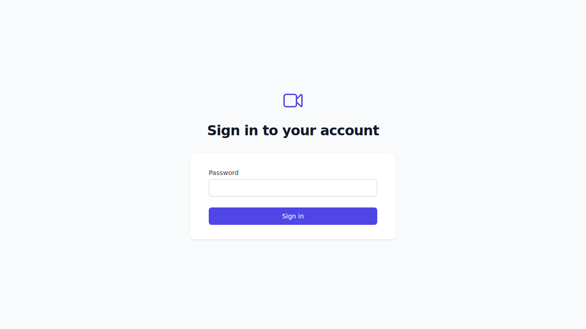
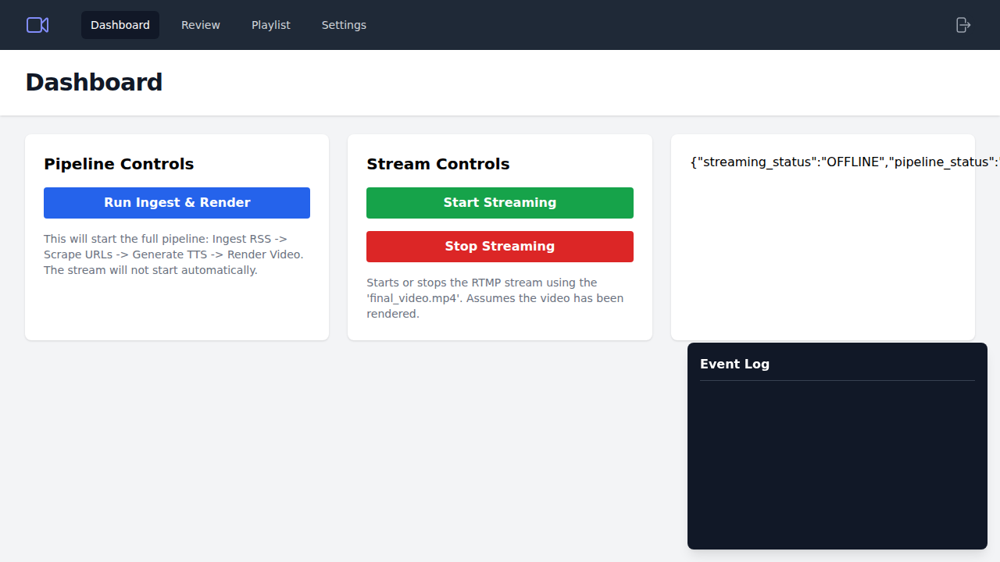
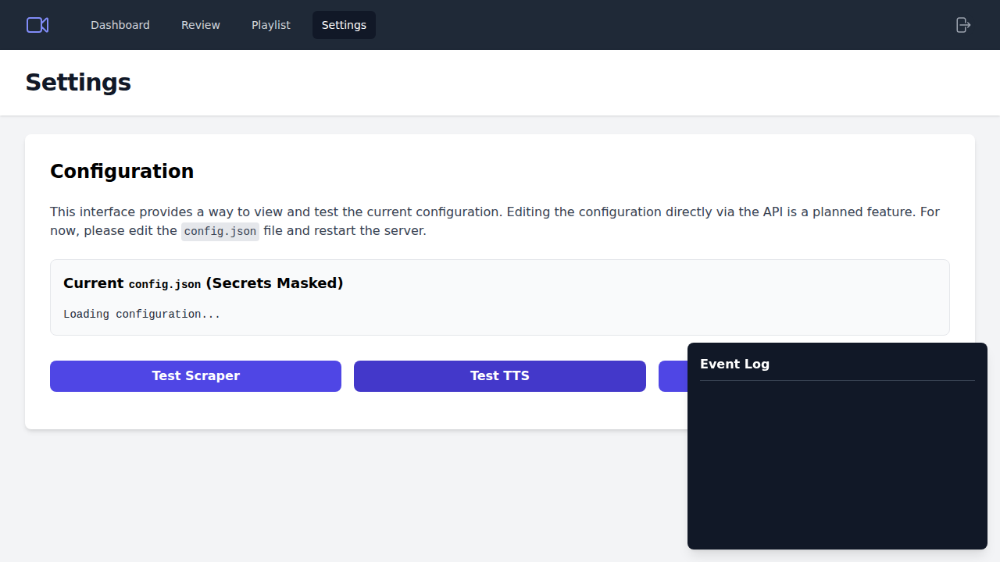

# Auto-Streamer

Auto-Streamer is a fully dockerized Python application that automates the process of creating and live-streaming video content 24/7. It ingests content from RSS feeds or direct URLs, converts the text to speech using OpenAI, renders a video, and streams it to RTMP endpoints like YouTube or Twitch.

It features a web-based dashboard for monitoring and control, a human approval workflow, and capabilities for automated content validation and publishing.

## Features

- **Automated Pipeline**: Ingests articles, generates audio (TTS), renders video, and streams.
- **Content Sources**: Supports RSS/Atom feeds and direct URL scraping.
- **High-Quality TTS**: Uses OpenAI's Text-to-Speech API for natural-sounding audio.
- **RTMP Streaming**: Streams to any RTMP-compatible service (YouTube, Twitch, etc.) with looping and auto-reconnection.
- **Web Dashboard**: A comprehensive UI for status monitoring, configuration, and manual control.
- **Approval Workflow**: Optional manual approval step before content goes live.
- **Auto-Approval System**: (Coming Soon) Rule-based system to automatically approve content based on custom criteria.
- **Dockerized**: Runs in a single, self-contained Docker container, compatible with both `x86_64` and `ARM64` architectures.
- **Observable**: Provides metrics via a Prometheus endpoint and real-time logs in the UI.

## Screenshots

| Login Page | Dashboard |
| :---: | :---: |
|  |  |

| Settings | Review Queue |
| :---: | :---: |
|  |  |

| Playlist |
| :---: |
|  |

---

## Getting Started

### Prerequisites

- **Docker**: The application is designed to run in Docker. [Install Docker](https://docs.docker.com/get-docker/).
- **OpenAI API Key**: You need an API key from OpenAI to use the TTS service.
- **RTMP Endpoint**: An RTMP URL and stream key from your streaming provider (e.g., YouTube Studio).

### 1. Configuration

First, you need to create a `config.json` file. You can copy the example file to get started:

```bash
cp app/config.json.example config.json
```

Now, edit `config.json` to fit your needs. At a minimum, you must:
- Add your RSS feed URLs to `ingest.rss_feeds`.
- Set your `rtmp_url` and `stream_key` in the `stream` section. **It is highly recommended to set the stream key via an environment variable instead of hardcoding it.**

### 2. Environment Variables

Create a `.env` file or export the following environment variables. These are essential for security and operation.

```bash
# Your streaming service's RTMP URL
export RTMP_URL="rtmp://a.rtmp.youtube.com/live2"

# Your unique stream key (KEEP THIS SECRET)
export STREAM_KEY="xxxx-xxxx-xxxx-xxxx"

# Your OpenAI API key (KEEP THIS SECRET)
export OPENAI_API_KEY="sk-..."

# A bcrypt-hashed password for logging into the web UI
# You can generate one using an online tool or a Python script.
# Example for password "admin": $2b$12$DwwA.a.c0.k5u...
export ADMIN_PASS_HASH='$2b$12$DwwA.a.c0.k5u...'

# The port for the web UI
export UI_PORT=8080
```

### 3. Build and Run

You can use the provided `Makefile` for convenience.

**1. Build the Docker Image:**
```bash
make build
```

**2. Run the Container:**
This command starts the web server. It mounts your local `output` directory to persist generated files and your `config.json` for easy editing.

```bash
make run
```
The web interface will be available at `http://localhost:8080`.

---

## How to Use

### Web UI Guide

- **Dashboard**: The main page shows the system status and provides high-level controls to start the pipeline or the stream.
- **Review**: If `require_approval` is `true` in your config, newly generated content will appear here. You can preview, approve, or reject items.
- **Playlist**: Shows all approved items that are ready for the next video render.
- **Settings**: Displays the current configuration (with secrets masked) and allows you to run tests for your setup.

### Command-Line Interface (CLI)

You can also manage the application via the CLI by running commands inside the container.

**Open a shell in the container:**
```bash
make shell
```

**Run the full pipeline (ingest -> tts -> render):**
```bash
python -m app.main all
```

**Run a single stage (e.g., ingest):**
```bash
python -m app.main ingest
```

**Approve an item:**
```bash
python -m app.main approve --id <ITEM_ID>
```

---

## Legal and Ethical Considerations

- **Copyright**: Only use content that you have the right to. Respect the copyrights and terms of service of the websites you scrape. This tool is provided for use with authorized content sources.
- **Robots.txt**: The scraper will respect `robots.txt` if `respect_robots` is enabled in the configuration.
- **Attribution**: It is good practice to provide attribution to the original source in your stream's description or on-screen.

## Troubleshooting

- **RTMP Connection Issues**: Double-check your `RTMP_URL` and `STREAM_KEY`. Ensure your firewall is not blocking the connection.
- **OpenAI Errors**: Verify your `OPENAI_API_KEY` and check your OpenAI account for billing issues.
- **Permission Errors**: If you see permission errors on startup, ensure the `output` directory on your host machine is writable by the user running Docker.
- **ARM64 Performance**: On devices like Raspberry Pi or Orange Pi, video rendering can be slow. Use the `veryfast` or `superfast` preset in your `config.json` and stick to 720p resolution for best results.
